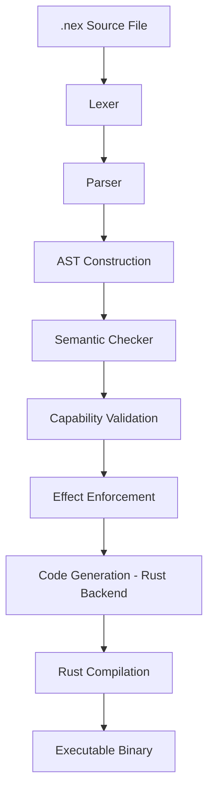

# NEX

**A deterministic, capability-safe, effect-typed systems language  
for governed autonomous execution.**

---

## Overview

NEX is an experimental execution language designed as a **secure substrate for autonomous agents and governed workloads**.

It is **not**:

- A scripting DSL  
- A general-purpose programming language  
- A replacement for Rust  

NEX exists to explore a specific question:

> Can we build an execution environment that refuses unsafe behavior by construction?

The language enforces:

- Explicit effect typing
- Deny-by-default capability security
- Structured concurrency (no orphan tasks)
- Deterministic cancellation semantics
- Bounded runtime resource governance
- Machine-readable audit telemetry

NEX programs either operate within declared authority — or they do not compile or execute.

---

## Design Principles

NEX is built around five core principles.

### 1. Determinism Over Convenience

- No ambient authority  
- No implicit side effects  
- No silent failure  

All authority must be declared.

---

### 2. Capability Security (Deny-by-Default)

File system and network access are not ambient.

Capabilities must be declared explicitly:

```nex
cap fs.read("examples/*.nex");

Generated programs cannot exceed declared authority.


### 3. Effect Typing

Functions must declare required effects:

fn main !async { }
fn main !io { }

Transitive effect checking prevents hidden behavior.


### 4. Structured Concurrency

Tasks form strict parent–child trees

No detached background work

No orphan threads

Cancellation propagates breadth-first through the subtree.


### 5. Governed Execution

Runtime execution is bounded by:

Cooperative fuel checkpoints

Memory ceilings

Deterministic cancellation

JSONL audit telemetry

NEX behaves as a bounded execution kernel, not just a DSL.


## Current Version
v0.4.3 — Governed Execution Kernel

This release establishes deterministic governed execution boundaries.

Includes:

Cooperative Fuel Model

Memory Governance

JSONL Audit Telemetry

BFS Subtree Cancellation

No-Orphan Task Enforcement

NEX_OUT_DIR isolated per-run workspace support

Deterministic golden test suite (fully green)

NEX now functions as a controlled execution substrate for autonomous workloads.

## Architecture
Compilation Pipeline


.nex Source
    ↓
Lexer
    ↓
Parser
    ↓
AST Construction
    ↓
Semantic Checker
    ↓
Capability + Effect Validation
    ↓
Rust Backend (Codegen)
    ↓
Rust Compilation
    ↓
Governed Executable

Runtime Model

The generated runtime enforces:

Atomic cancellation tokens

Deterministic join ordering

Resource governance hooks injected at compile-time

Structured task registry

JSON machine-readable audit logs

All violations are recorded deterministically.

Example
Structured Concurrency

fn main !async {
    spawn {
        print("child running");
    }
}

Explicit Capability Declaration

cap fs.read("examples/*.nex");

fn main !io {
    let content = read_file("examples/demo.nex");
    print(content);
}


## Running
cargo build
./target/debug/nex check examples/demo.nex
./target/debug/nex run examples/demo.nex

## Isolated Builds

#Per-run workspaces:

NEX_OUT_DIR=target/run_1 ./target/debug/nex run examples/demo.nex

##Resource Budgets

NEX_FUEL_BUDGET=1000
NEX_MEM_BUDGET=1024
NEX_AUDIT_PATH=audit.jsonl

## Security Model

# NEX enforces authority at compile time and runtime:

Capabilities must be declared explicitly

Effects must be declared at function boundaries

Network ports must be statically provable

File access must match declared glob patterns

No detached tasks (structured concurrency invariant)

The compiler guarantees that generated programs cannot exceed declared authority.

Roadmap
v0.5.x — Observability & Replay

Run envelope events

Event sequencing

Deterministic replay harness

v0.6.x — Stable IR & Tooling

Stable HIR/MIR

Tool ecosystem

Safe web/search tools

v0.7.x — Multi-Agent Execution

Swarm governance

Verified self-improvement boundaries

v1.0 — Production-Grade Governed Kernel
Status

NEX is experimental.

It is a research-driven systems exploration into safe autonomous execution.
---

## License

Apache-2.0
# Compiler Architecture

NEX follows a deterministic, multi-stage compilation pipeline.



---

## Security Model

NEX enforces authority at compile time:

• Capabilities must be declared explicitly  
• Effects must be declared at function boundaries  
• Network ports must be statically provable  
• File access must match declared glob patterns  
• No detached tasks (structured concurrency invariant)

The compiler guarantees that generated programs cannot exceed declared authority.

---

## Documentation

- [Architecture](docs/architecture.md)
- [Runtime Model](docs/runtime.md)
- [Security Model](docs/security.md)
- [Language Specification](docs/spec.md)
- [Versioning Policy](docs/versioning.md)
- [Roadmap](docs/roadmap.md)
- [Design Principles](docs/DESIGN.md)
- [Governance](docs/GOVERNANCE.md)
- [Contributing Guide](docs/CONTRIBUTING.md)
- [RFC Process](docs/rfcs/0000-template.md)

---


