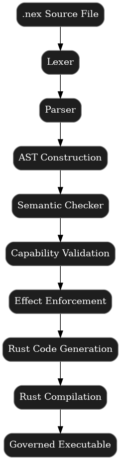

```markdown
# NEX

A deterministic, capability-safe, effect-typed systems language  
for governed autonomous execution.
=======
# NEX

A deterministic, capability-safe, effect-typed systems language designed as a **governed execution substrate** for autonomous agents.

NEX compiles to a Rust-based runtime with **deny-by-default capabilities**, **explicit effects**, **structured concurrency**, and **bounded resource governance**. The goal is not convenience—it is to make unsafe behavior **unrepresentable** in well-typed programs, and **non-viable** at runtime.

**Status:** experimental, actively evolving.  
**Current release:** v0.4.3 — Governed Execution Kernel (fuel + memory budgets, JSONL audit telemetry, BFS cancellation, per-run workspace isolation).

- **Determinism first:** predictable semantics over implicit magic  
- **Least authority:** capabilities are declared explicitly and validated  
- **Effect transparency:** `!io` and `!async` are mandatory at boundaries  
- **No orphan tasks:** structured concurrency enforced at runtime  
- **Governed execution:** fuel checkpoints, memory ceilings, audit traces

## Quick Links

- **Docs:** see `/docs/` (architecture, runtime model, security model, versioning)  
- **Examples:** see `/examples/`  
- **Golden tests:** `cargo test --test golden`

## Project Positioning

NEX is a **policy-enforcing execution language**: a small systems language intentionally designed to serve as a safe-by-construction substrate for autonomous agent workloads.

It occupies a specific design space:

- **Not a general-purpose language:** NEX is optimized for governed execution, not broad developer ergonomics.
- **Not an interpreted sandbox:** NEX is compiled, with semantics enforced via static checks and runtime governance.
- **Not “prompt-level safety”:** safety is encoded in the language model itself (capabilities, effects, task structure, and budgets).

### What NEX Guarantees

In a well-formed NEX program:

1. **Authority is explicit**
   - filesystem/network access is denied by default and must be declared via capabilities.
2. **Side effects are explicit**
   - I/O and concurrency require explicit effect declarations (`!io`, `!async`) at function boundaries.
3. **Concurrency is structured**
   - tasks form a strict parent–child tree; cancellation propagates down the subtree; no orphan background work.
4. **Execution is governed**
   - programs run with bounded resource budgets (fuel + memory) and emit machine-readable audit telemetry.

### Why This Matters (for autonomous agents)

Autonomous systems fail differently than human software. When an agent misbehaves, “just don’t do that” is not a control strategy. NEX treats governance as a **kernel primitive**: the compiler and runtime cooperate to constrain behavior deterministically, preserving auditability and safe termination.

NEX is designed to become the **execution kernel layer** inside NEXUS OS—where agents can be powerful, but never unbounded.


## Why This Exists

Modern AI systems increasingly execute generated code.

That code:
- Reads files
- Opens sockets
- Spawns tasks
- Talks to networks

Most languages allow this implicitly.

NEX does not.

In NEX:
- Every side effect must be declared.
- Every capability must be granted.
- Every task must be accounted for.

No silent escalation.
No hidden IO.
No orphan tasks.

If the compiler cannot prove it is safe, it refuses to compile.
>>>>>>> 0f63f2a (docs: add architecture animation and update README)

---

## Overview

NEX is an experimental execution language designed as a secure substrate for autonomous agents.

It is not:
- A scripting DSL
- A general-purpose language
- A replacement for Rust

NEX explores one central question:

> Can an execution environment refuse unsafe behavior by construction?

The language enforces:

- Explicit effect typing
- Deny-by-default capability security
- Structured concurrency
- Deterministic cancellation
- Bounded resource governance
- Machine-readable audit telemetry

---

## Design Principles

### 1. Determinism Over Convenience

No silent failure.  
No implicit capability escalation.  
All side effects must be declared.

---

### 2. Capability Security (Deny-by-Default)

```nex
cap fs.read("examples/*.nex");
```

Generated programs cannot exceed declared authority.

---

### 3. Effect Typing

```nex
fn main !async { }
fn main !io { }
```

Transitive effect checking prevents hidden behavior.

---

### 4. Structured Concurrency

Tasks form strict parent–child trees.  
No orphan threads.  
No detached background work.

---

### 5. Governed Execution

Execution is bounded by:

- Cooperative fuel checkpoints
- Memory ceilings
- Deterministic cancellation
- JSONL audit logging

NEX behaves as a bounded execution kernel.

---

## Current Version

### v0.4.3 — Governed Execution Kernel

This version includes:

- Cooperative Fuel Model
- Memory Governance
- JSONL Audit Telemetry
- BFS Subtree Cancellation
- No-Orphan Task Enforcement
- `NEX_OUT_DIR` isolated per-run build directories
- Deterministic golden test suite (fully green)

---

## Architecture

NEX follows a deterministic compilation pipeline:

## Compiler Architecture

NEX follows a deterministic, multi-stage compilation pipeline:



---

## Runtime Model

Generated programs include:

- Atomic cancellation tokens
- Deterministic join ordering
- Resource governance hooks
- Structured task registry
- JSON machine-readable audit logs

All violations are recorded deterministically.

---

## Example

### Structured Concurrency

```nex
fn main !async {
    spawn {
        print("child running");
    }
}
```

### Explicit Capability Declaration

```nex
cap fs.read("examples/*.nex");

fn main !io {
    let content = read_file("examples/demo.nex");
    print(content);
}
```

---

## Running

```bash
cargo build
./target/debug/nex check examples/demo.nex
./target/debug/nex run examples/demo.nex
```

---

## Isolated Builds

```bash
NEX_OUT_DIR=target/run_1 ./target/debug/nex run examples/demo.nex
```

---

## Resource Budgets

```bash
NEX_FUEL_BUDGET=1000
NEX_MEM_BUDGET=1024
NEX_AUDIT_PATH=audit.jsonl
```

---

## Security Model

NEX enforces authority at compile-time and runtime:

- Capabilities must be declared explicitly
- Effects must be declared at function boundaries
- Network ports must be statically provable
- File access must match declared glob patterns
- No detached tasks (structured concurrency invariant)

The compiler guarantees that generated programs cannot exceed declared authority.

---

## Roadmap

### v0.5.x — Observability & Replay
- Run envelope events
- Event sequencing
- Deterministic replay harness

### v0.6.x — Stable IR & Tool Ecosystem
- Stable HIR/MIR
- Safe web/search tools

### v0.7.x — Multi-Agent Execution
- Swarm governance
- Verified self-improvement boundaries

### v1.0 — Production-Grade Governed Kernel

---

## Status

NEX is experimental.

It is a research-driven systems exploration into safe autonomous execution.

---

---

## License

Apache-2.0


---

## Security Model

NEX enforces authority at compile time:

• Capabilities must be declared explicitly  
• Effects must be declared at function boundaries  
• Network ports must be statically provable  
• File access must match declared glob patterns  
• No detached tasks (structured concurrency invariant)

The compiler guarantees that generated programs cannot exceed declared authority.

---

## Documentation

- [Architecture](docs/architecture.md)
- [Runtime Model](docs/runtime.md)
- [Security Model](docs/security.md)
- [Language Specification](docs/spec.md)
- [Versioning Policy](docs/versioning.md)
- [Roadmap](docs/roadmap.md)
- [Design Principles](docs/DESIGN.md)
- [Governance](docs/GOVERNANCE.md)
- [Contributing Guide](docs/CONTRIBUTING.md)
- [RFC Process](docs/rfcs/0000-template.md)

---


