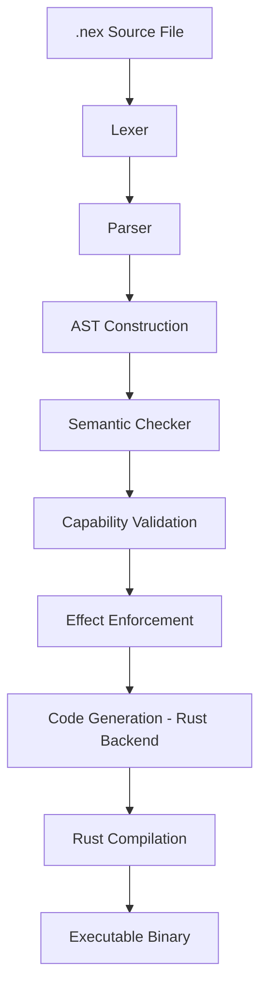

# NEX

A deterministic, capability-safe, effect-typed systems language  
for governed autonomous execution.

---

## Overview

NEX is an experimental execution language designed as a **secure substrate for autonomous agents**.

It is not a scripting DSL and not a general-purpose programming language.

NEX exists to answer a specific question:

> Can we build an execution environment that refuses unsafe behavior by construction?

The language enforces explicit effects, deny-by-default capability security,
structured concurrency, and bounded resource governance at runtime.

---

## Design Goals

NEX is built around five core principles:

### 1. Determinism Over Convenience
No silent failure. No implicit capability escalation.
All side effects must be declared explicitly.

### 2. Capability Security (Deny-by-Default)
File system and network access are not ambient.
They must be declared via explicit capability policies.

### 3. Effect Typing
Functions must declare `!io` or `!async` when required.
Transitive effect checking prevents hidden behavior.

### 4. Structured Concurrency
Tasks form a strict parent–child tree.
No orphan threads. No detached background work.

### 5. Governed Execution
Execution is bounded by:
- Cooperative fuel checkpoints
- Memory ceilings
- Deterministic cancellation semantics
- Audit telemetry

---

## Current Version

**v0.4.3 – Governed Execution Kernel**

This version includes:

- Cooperative Fuel Model (v0.4.0)
- Memory Governance
- JSONL Audit Telemetry
- BFS Subtree Cancellation
- No-Orphan Task Enforcement
- `NEX_OUT_DIR` workspace isolation
- Deterministic golden test suite (fully green)

NEX now behaves as a **bounded execution kernel** rather than a simple DSL.

---

## Architecture

Compilation pipeline:
Lexer → Parser → AST → Semantic Checker → Rust Backend (Codegen)


Runtime model:

- Custom cancellation tokens (atomic flag based)
- BFS subtree cancellation
- Deterministic join ordering
- Resource governance hooks injected at compile-time
- JSONL machine-readable audit log

---

## Example

```nex
fn main !async {
    spawn {
        print("child running");
    }
}

Capabilities must be declared explicitly:

cap fs.read("examples/*.nex");

fn main !io {
    let content = read_file("examples/demo.nex");
    print(content);
}
Running
cargo build
./target/debug/nex check examples/demo.nex
./target/debug/nex run examples/demo.nex

To isolate builds:

NEX_OUT_DIR=target/run_1 ./target/debug/nex run examples/demo.nex

To control resource budgets:

NEX_FUEL_BUDGET=1000
NEX_MEM_BUDGET=1024
NEX_AUDIT_PATH=audit.jsonl
What NEX Is Not

Not a general-purpose language

Not a replacement for Rust

Not an interpreted sandbox

Not a toy DSL

NEX is a controlled execution layer for autonomous workloads.

Roadmap
v0.5.x – Observability & Replay

Run envelope events

Event sequencing

Deterministic replay harness

v0.6.x – Stable IR & Tool Ecosystem

Stable HIR/MIR

Safe web/search tools

v0.7.x – Multi-Agent Execution

Swarm governance

Verified self-improvement boundaries

v1.0 – Production-Grade Governed Kernel
Status

This project is experimental.

It is a research-driven systems exploration into safe autonomous execution.

---

## License

Apache-2.0
# Compiler Architecture

NEX follows a deterministic, multi-stage compilation pipeline.



---

## Security Model

NEX enforces authority at compile time:

• Capabilities must be declared explicitly  
• Effects must be declared at function boundaries  
• Network ports must be statically provable  
• File access must match declared glob patterns  
• No detached tasks (structured concurrency invariant)

The compiler guarantees that generated programs cannot exceed declared authority.

---

## Documentation

- [Architecture](docs/architecture.md)
- [Runtime Model](docs/runtime.md)
- [Security Model](docs/security.md)
- [Language Specification](docs/spec.md)
- [Versioning Policy](docs/versioning.md)
- [Roadmap](docs/roadmap.md)
- [Design Principles](docs/DESIGN.md)
- [Governance](docs/GOVERNANCE.md)
- [Contributing Guide](docs/CONTRIBUTING.md)
- [RFC Process](docs/rfcs/0000-template.md)

---


