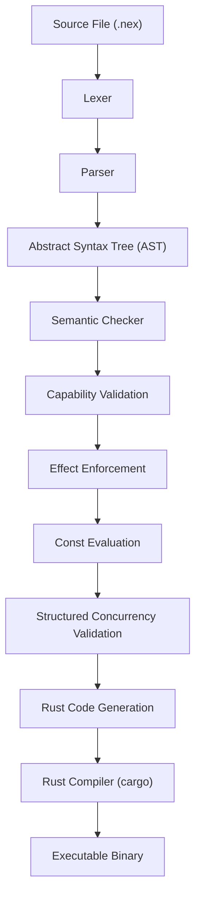

# NEX Architecture Overview

NEX is a deterministic, capability-safe, effect-typed systems language designed for secure autonomous execution.

The compiler follows a strict multi-stage pipeline.  
Each stage has a single responsibility and produces a validated intermediate form.

---

## Compilation Pipeline



---

## Stage Responsibilities

### 1. Lexer
Transforms raw source text into structured tokens.

- Deterministic tokenization
- Span-aware for precise diagnostics
- No implicit rewriting

---

### 2. Parser
Builds a strongly-typed Abstract Syntax Tree (AST).

- Validates syntax correctness
- Constructs structured program representation
- Preserves span metadata

---

### 3. Semantic Checker
Performs static correctness validation.

Ensures:

- Type correctness
- Function signature integrity
- Deterministic return analysis
- Valid control flow

---

### 4. Capability Validation
Enforces explicit authority declaration.

Ensures:

- File access matches declared glob patterns
- Network ports match declared numeric ranges
- No implicit authority escalation
- No undeclared resource access

Example:

```
cap fs.read("logs/*.txt");
cap net.listen(8000..9000);
```

---

### 5. Effect Enforcement
Functions must explicitly declare side effects.

Supported effects:

- `!io`
- `!async`

Compile-time guarantees:

- No hidden side effects
- No implicit I/O
- Pure functions remain pure

---

### 6. Const Evaluation
Evaluates constant expressions at compile time.

- Literal folding
- Constant function resolution
- Deterministic compile-time evaluation

Rejects:

- Dynamic authority computation
- Non-deterministic const logic

---

### 7. Structured Concurrency Validation
Enforces deterministic task trees.

Guarantees:

- No detached tasks
- Parent-child task registry
- Subtree cancellation propagation
- Deterministic join semantics
- Root cleanup at program exit

---

### 8. Rust Code Generation
Generates safe Rust backend code.

- Capability-safe wrappers
- Effect-aware runtime scaffolding
- Deterministic task runtime
- Zero implicit privilege elevation

---

### 9. Rust Compilation
Uses Cargo to produce the final binary.

- Type-checked backend
- Memory-safe execution
- Deterministic runtime behavior

---

# Core Design Principles

NEX is built on the following invariants:

1. Determinism by default  
2. Explicit authority model  
3. Compile-time policy enforcement  
4. Runtime behavior mirrors static guarantees  
5. No hidden side effects  
6. No implicit concurrency  

---

# Architectural Philosophy

NEX is not a scripting language.

It is an execution substrate for autonomous systems, where:

- Security is enforced by the type system  
- Authority must be declared before use  
- Concurrency is structured and bounded  
- The compiler prevents privilege escalation  

NEX is designed as a foundation for AI-native execution environments.

---
